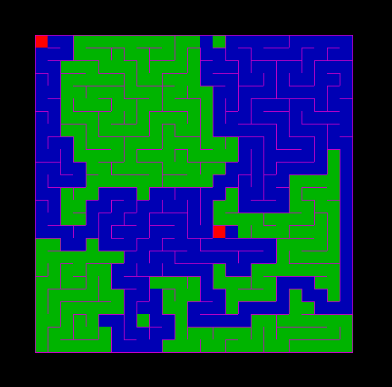

# Maze Generator/Viewer/Solver
 This is a python based maze simulation project intended for the following activities:

- Generator 
- Viewer
- Solver
- Designer
- Editor

 Future updates expected to include optimizations such as GUI implementations and applying different types of path-searching algorithms.

# Usage:

[Generate Maze] - uses A-star path-finding algorithm to generate an arbitrary maze.

> $ python mazeGenerator.py [number of mazes to generate] [number of CPUs for parallel processing]

> $ python mazeGenerator.py  # both inputs are optional, default values are 1 maze and 1 CPU.

[Design Maze] - user can design maze using mouse functionalities (left-button = build wall, right-button = remove wall, middle-button = saves the maze and exits the pygame window)

> $ python mazeDesigner.py

[Edit Maze] - user can modify existing maze(s) using mouse functionalities.

> $ python mazeEditor.py [an integer (maze ID) for viewing the maze]

> $ python mazeEditor.py  # without input, maze 1 is loaded for editing

[View Maze]

> $ python mazeViewer.py [an integer (maze ID) for viewing the maze]

> $ python mazeViewer.py  # without input, all generated mazes are viewed.

[Solve Maze]

> $ python mazeSolver.py [an integer (maze ID) for solving the maze and viewing the process]

> $ python mazeSolver.py  # without input, maze 1 is solved by default.

# Modify settings.py according to your needs.

